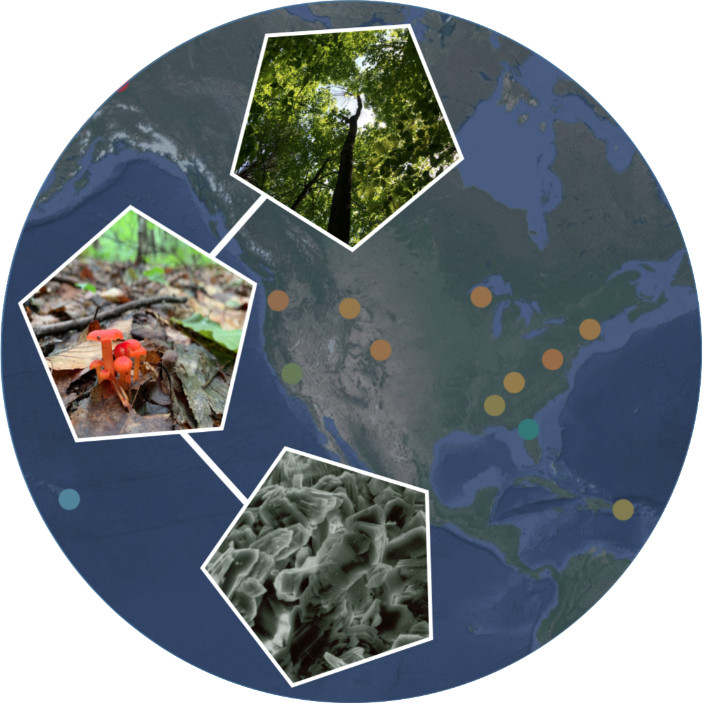
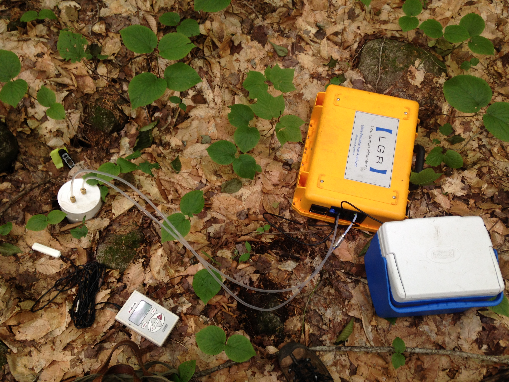
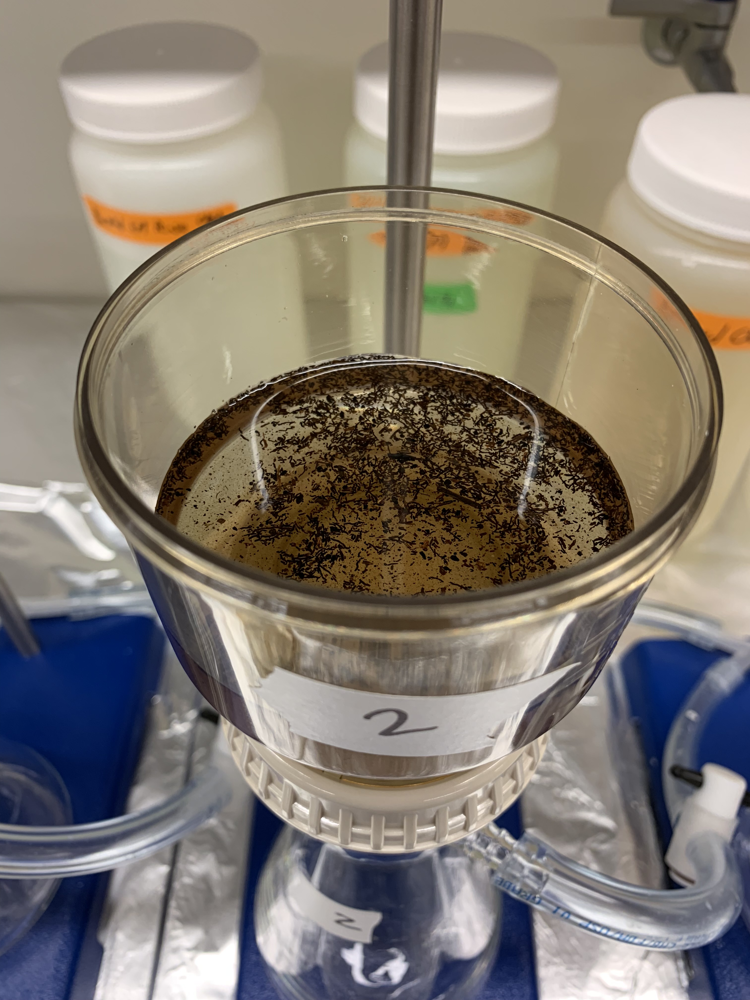

### **Controls on the formation and persistence of Mineral-Associated Organic Matter (MAOM)**

#### I am collaborating with Dr. Rich Phillips (Indiana University) and Dr. Jennifer Pett-Ridge (Lawrence Livermore National Lab) to answer key questions about the stability of carbon on soil minerals in ecosystems across the U.S. Using soil collected at sites within the NEON network, we aim to characterize the conditions that favor MAOM formation and understand the potential drivers of its long-term persistence. 

{width="50%"}

    

***

### **Mycorrhizal fungi as drivers of soil carbon cycling in northern forests**

#### For my dissertation, I studied the role of mycorrhizal fungi on three key processes in the forest carbon cycle: leaf litter decomposition, soil respiration, and organic matter stabilization on soil minerals. In these studies, I found that the importance of dominant tree mycorrhizal associations increased as organic matter moved further along in the process of decomposition. For example, rates of leaf litter decay were not sensitive to tree mycorrhizal type, but the size and composition (C:N) of the mineral-associated organic matter pool was distinct in forests dominated by trees with arbuscular mycorrhizal (AM) associations versus those with ectomycorrhizal (ECM) associations. Interestingly, these effects were noted despite controlling for co-varying traits of AM and ECM-associated trees, such as the chemical composition of leaf litter.  

{width="25%"}{width="50%"}{width="25%"}

