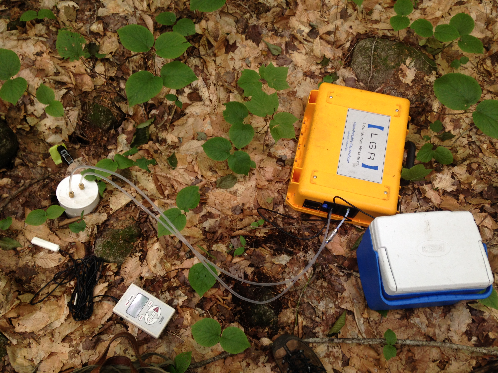

   
   ***  
   
## As part of my dissertation, I tested how mycorrhizal fungi influence soil respiration rate at Hubbard Brook Experimental Forest. I measured soil respiration at intervals throughout the growing season in a series of 21 forest plots dominated by AM-associated tree species, ECM-associated tree species, or both. 

{width="100%"}  

***  


### We found that soil conditions were different in plots with different dominant mycorrhizal associations.  

```{r soilchars, echo = FALSE, message=FALSE, fig.align='center', out.width='75%', fig.pos='H'}
knitr::include_graphics("~/Documents/Website/ashleylang.github.io/images/soilchars.jpg")
```

***  


### These differences in soil conditions led to higher soil respiration rate in AM-dominated forest plots. Plots with both AM and ECM fungi had similar soil respiration rates as ECM plots. There was no difference in the amount of roots in each plot type, so we felt confident that heterotrophic respiration, which is influenced by soil chemistry and organic horizon depth, led to the patterns we observed.  

```{r resp_rate, echo = FALSE, message=FALSE, fig.align='center', out.width='75%', fig.pos='H'}
knitr::include_graphics("~/Documents/Website/ashleylang.github.io/images/resp_rate.jpg")
```

***  


### Interestingly, we also noticed that the basal area of AM and ECM trees in each plot corresponded only weakly with the percentage of AM and ECM associated fine roots in the soil. This suggests that belowground mycorrhizal dominance may not always be easily assumed based on tree basal area.  

```{r trees_roots, echo = FALSE, message=FALSE, fig.align='center', fig.cap="(Solid line indicates 1:1)", out.width='75%', fig.pos='H'}
knitr::include_graphics("~/Documents/Website/ashleylang.github.io/images/sa.jpg")
```

***  


This work is published in the journal *Ecosystems*. You can access a PDF of the manuscript below.

```{r out.width="100%", out.height="500", echo=FALSE}
knitr::include_graphics('~/Documents/Website/ashleylang.github.io/Lang2019.pdf')
```